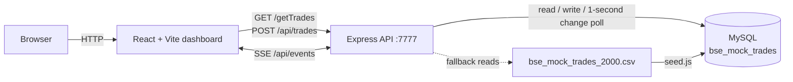

# Architecture note

## Overview

## Components

| Component | Responsibility |
| --- | --- |
| React frontend | Displays trades, fetches API data, submits inserts, and subscribes to SSE updates. |
| Express backend | Provides REST endpoints, owns database access, validates/formats requests, and broadcasts trade-change events. |
| MySQL | Stores the canonical `bse_mock_trades` dataset and supports indexed trade queries. |
| Seeder and CSV | Provides reproducible local data initialization; the CSV is also the API's fallback data source. |

## Data flow

1. The dashboard loads the current trade list from `GET /getTrades`.
2. A user insert is sent to `POST /api/trades`, which persists it in MySQL.
3. The API broadcasts a `trades_updated` event over its SSE stream; connected dashboards refresh their data.
4. The API also polls MySQL for externally inserted records and emits the same update event, keeping the UI current even when a different writer changes the table.

## Why this design

- **Clear boundary:** the browser never connects to MySQL; credentials and SQL stay in the API service.
- **Simple real time:** SSE is a good fit for one-way server-to-browser updates, with less protocol and state-management overhead than WebSockets.
- **Local resilience:** the CSV lets the API remain useful when MySQL is unavailable, while the seed script makes a complete database easy to recreate.
- **Operationally small:** Vite, Express, and one MySQL table keep the application easy to run locally without extra message brokers or background services.

## Trade-offs

The one-second database poll is intentionally straightforward for a mock/local workload. At higher scale, replace it with database change data capture or an event broker, and restrict CORS plus add authentication before exposing the API outside a trusted environment.
